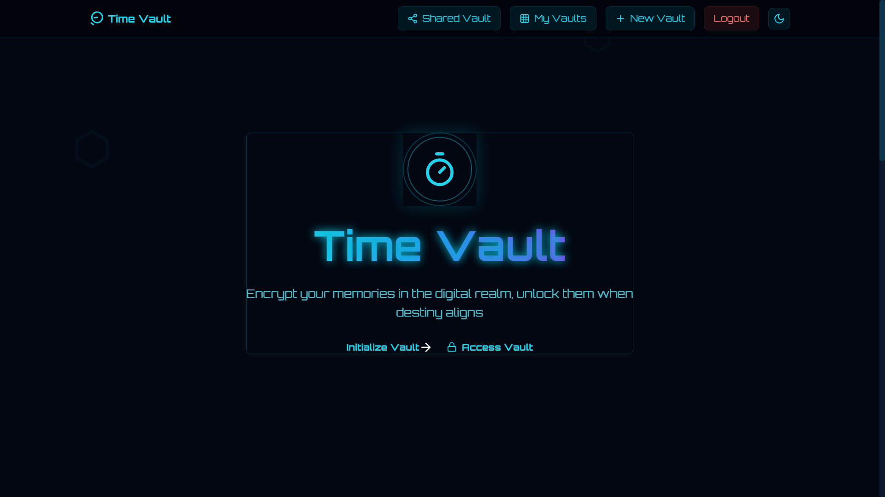
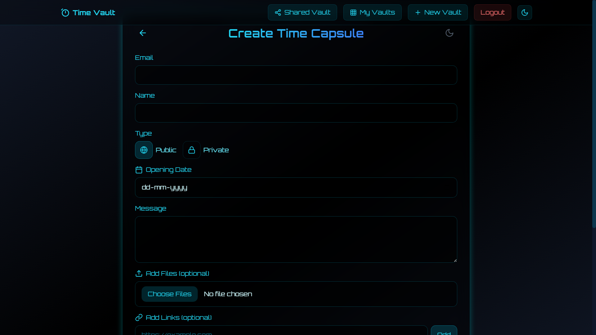

# Time Vault - Digital Time Capsule Platform 🚀

> Lock your memories in the digital realm, unlock them when destiny aligns.

## 📌 Table of Contents
- [Overview](#overview)
- [Key Features](#key-features)
- [Screenshots](#screenshots)
- [User Features](#user-features)
- [Security](#security)
- [Interface Design](#interface-design)

## Overview

Time Vault is a cutting-edge digital time capsule platform that allows users to securely store and share memories with future unlock dates. Built with a stunning futuristic design, it offers both private and public capsule options.

## Key Features

### 🔒 Capsule Security
- **Private/Public Options**
- **Time-Locked Access**
- **Unique Access Codes**
- **Email Verification**

### 🎨 Modern Interface
- **Cyber Theme Design**
- **Glassmorphism Effects**
- **Smooth Animations**
- **Dark Mode Optimized**

### ⚡ Core Functions
- **Smart Dashboard**
- **Easy Capsule Creation**
- **Link Integration**
- **Access Management**

## Screenshots

### Dashboard View

*Main dashboard with time capsule management*

### Capsule Creation

*Intuitive capsule creation interface*

## User Features

### 📝 Content Management
- Set future unlock dates
- Add personal messages
- Include external links
- Manage visibility settings

### 🎯 Dashboard Features
- View all capsules
- Track unlock dates
- Quick access controls
- Status monitoring

### 🔗 Sharing Options
- Generate access codes
- Email sharing
- Public discovery
- Access control

## Security

### 🛡️ Protection Features
- Encrypted storage
- Access verification
- Unique access codes
- Secure authentication

## Interface Design

### 🎨 Visual Elements
- Gradient effects
- Glassmorphism UI
- Fluid animations
- Responsive design

### 📱 User Experience
- Intuitive navigation
- Loading indicators
- Success confirmations
- Error handling

---

### Future Updates
- [ ] Advanced templates
- [ ] Social sharing
- [ ] Collaborative features
- [ ] Multi-language support

> "Preserve today's memories for tomorrow's discovery."

---

**Platform Status:** Active Development  
**Last Updated:** February 2024  
**Version:** 1.0.0
    